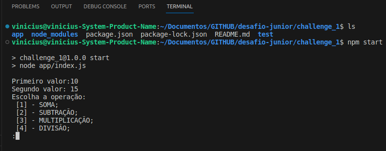
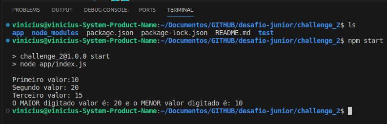
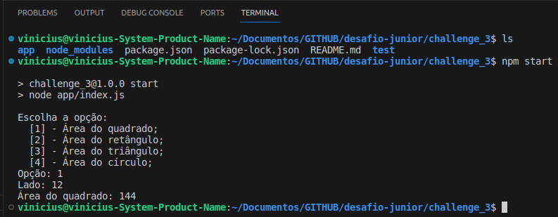
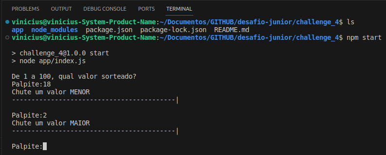
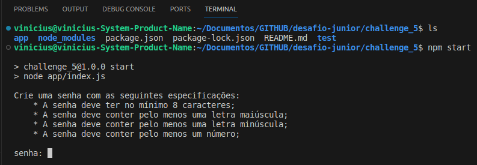
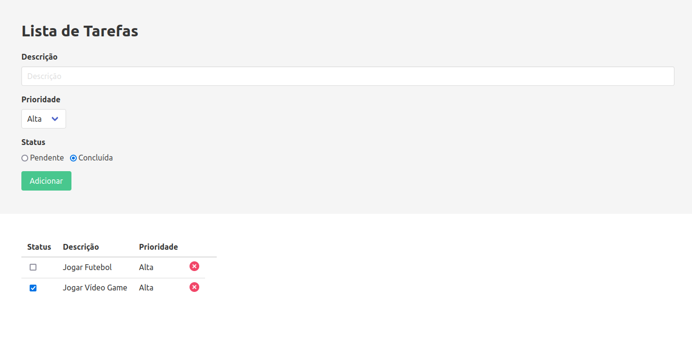
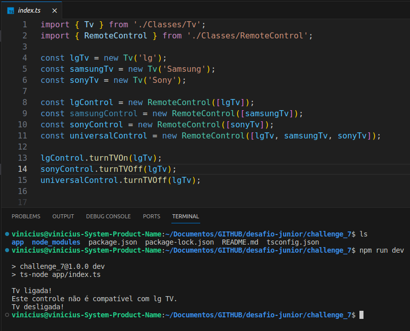
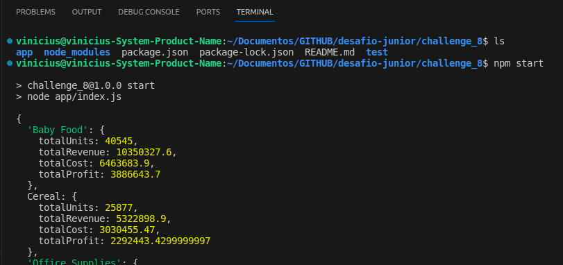
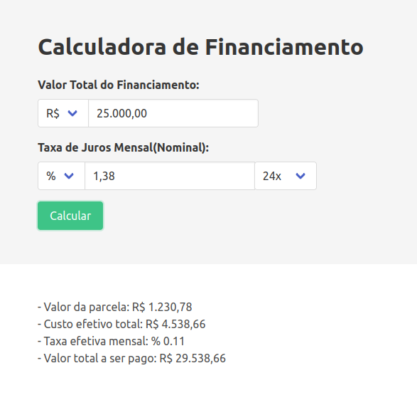
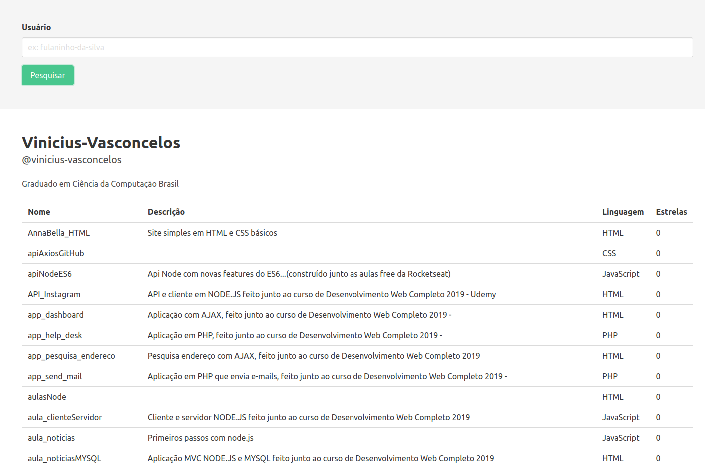

# Desafio iPag - Desenvolvedor(a) Júnior

## Introdução

- Dentro de cada diretório denominado `challenge_n`, há um arquivo `README.md` com indicações de como executar cada aplicação separadamente.
- Todos os desafios foram feitos utilizando JavaScript, mais especificamente Node.js na versão `20.11.1`.
- Os desafios construídos apenas com back-end possuem testes de unidade implementados. As instruções de execução estão em seus respectivos README.md.
- Os desafios foram construídos no Linux Ubuntu `jammy 22.04.4 LTS`, por isso a utilização de conteinerização Docker.
  - Docker version `25.0.4`;
  - Docker Compose version `v2.24.5`
- Através deste `README.md`, você conseguirá manipular as aplicações através dos scripts abaixo e também poderá executar todos os testes de uma vez.
- Qualquer dúvida acerca do projeto, entrar em contato com: `viniciussouzav@gmail.com`.

## Executando com Docker 🐳

> **⚠️ Atenção:** _É necessário ter o Docker e o docker-compose instalados em sua máquina!_

- Suba o container utilizando o comando abaixo:

```bash
docker-compose up -d
```

- Após finalizar, será gerado um container chamado `node-app`, conforme mostrado na figura abaixo:


- Entre no container executando o comando abaixo:

```bash
docker exec -it node-app bash
```

- Após esses passos, siga as instruções conforme descritas nos demais `README.md`...

## Executando testes a partir da raiz 🌿

- Com o Node.js ou Docker devidamente instalados em sua máquina, para instalar todas as dependências de cada `challenge_N`, executando o comando abaixo:

```bash
npm run install-all
```

- Para executar todos os testes de unidade, utilize:

```bash
npm test
```

## Exercícios de Programação

### 1. Calculadora Básica:

* Crie uma calculadora que realize as operações básicas: soma, subtração, multiplicação e divisão.
* Permita a entrada de dois números e a escolha da operação.
* Exiba o resultado da operação na tela.



### 2. Maior e Menor entre Três Números:

* Escreva um programa que peça ao usuário três números.
* Determine o maior e o menor número entre os três e exiba-os na tela.



### 3. Área de Formas Geométricas:

* Crie um programa que seja capaz de calcular a área de formas geométricas.
* O programa deve permitir o cálculo da área de um quadrado, retângulo, triângulo e círculo.
* O usuário deve escolher a forma geométrica e informar os dados necessários para o cálculo da área.



### 4. Jogo da Adivinhação:

* Crie um programa que gere um número aleatório entre 1 e 100.
* O usuário deve tentar adivinhar o número com o mínimo de tentativas possível.
* Dê dicas ao usuário, informando se o seu palpite está "acima", "abaixo" ou se ele adivinhou o número.



### 5. Validador de Senha:

* Escreva um programa que peça ao usuário uma senha.
* A senha deve ter no mínimo 8 caracteres e conter pelo menos uma letra maiúscula, uma letra minúscula e um número.
* Valide a senha e informe ao usuário se ela é válida ou não.



### 6. Lista de Tarefas:

* Crie um programa que permita ao usuário adicionar, remover e visualizar tarefas.
* Cada tarefa deve ter descrição, prioridade e um status (pendente ou concluída).
* O programa deve permitir a navegação, ordenação e edição da lista de tarefas.



### 7. Manipulação e Comunicação de Objetos:

* Crie um programa que conecte controles de marcas diferentes (LG, Samsung, Sony, etc) a uma ou mais TVs.
* O programa deve permitir a seleção de um controle e a comunicação com a TV para ligar e desligar;
* As TVs e controles devem ser representados por objetos, e a comunicação entre eles deve ser feita por métodos.
* O programa deve exibir na tela as ações realizadas e o estado atual da TV.
* Caso o controle selecionado não seja compatível com a TV, o programa deve exibir uma mensagem de erro.



### 8. Estatísticas de Vendas:

* Leia o arquivo em anexo "sales.csv" que contém dados de vendas agrupados por tipo e país.
* Crie um programa que calcule e exiba as seguintes estatísticas:
  * Vendas (total de unidades vendidas, total de receita, custo total, lucro total) por tipo de produto.
  * Vendas por tipo de produto e região.
  * Tipo de produto com maior receita de cada país.

  

### 9. Simulador de Financiamento:

* Crie um programa que simule o calculo de financiamento de um imóvel ou veículo, baseado na tabela PRICE.
* O programa deve solicitar o valor total do financiamento, a quantidade de parcelas e a taxa nominal de juros anual.
* O programa deve exibir o valor da parcela, o valor total a ser pago, o custo efetivo total do financiamento e a taxa efetiva mensal.
* O programa deve permitir a simulação de diferentes cenários de financiamento.

Para este exercício utilize as seguintes fórmulas:

* **Valor da parcela**: `PMT = PV * (i / (1 - (1 + i)^-n))`, onde `PMT` é o valor da parcela, `PV` é o valor total financiado, `i` é a taxa de juros mensal efetiva e `n` é a quantidade de parcelas.
* **Custo efetivo total**: `CET = (PMT * n) - PV`, onde `CET` é o custo efetivo total, `PMT` é o valor da parcela e `PV` é o valor total financiado.
* **Taxa efetiva mensal**: `im = (1 + i)^(1/12) - 1`, onde `im` é a taxa de juros mensal efetiva e `i` é a taxa de juros nominal anual.



### 10. Manipulação de API:

* Utilizando a API REST do GitHub, desenvolva um script que faça uma requisição para obter os repositórios de um usuário e exiba as informações na tela.
* O usuário deve informar o nome do usuário do GitHub.
* O script deve exibir o nome, descrição, linguagem e quantidade de estrelas de cada repositório.


